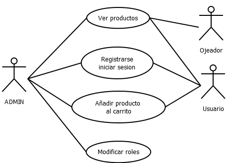
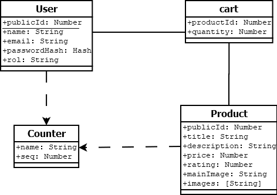
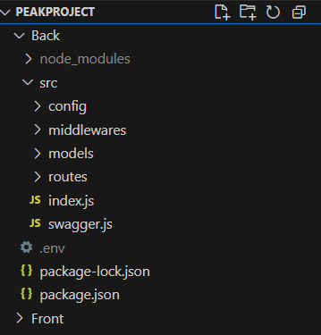
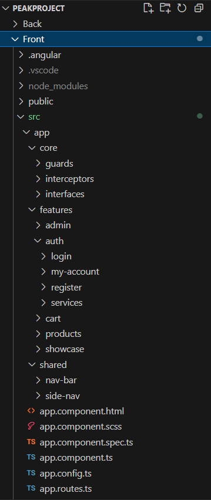

# Peak Project

<div align="center">
  
</div>

## Miguel Fuentes Arribas  
**Proyecto Integrado - 2ºDAM (2024/2025)**  

---

## Índice

1. [Introducción](#1-introducción-1-página)  
2. [Especificación de Requisitos](#2-especificación-de-requisitos)  
3. [Diseño (Diagramas)](#3-diseño-diagramas)  
4. [Implementación (GIT)](#4-implementación-git)  
5. [Resultado (Manual de usuario)](#5-resultado-manual-de-usuario)  
6. [Conclusiones](#6-conclusiones)  

---

## 1. Introducción (1 página)

### Resumen del proyecto

Peak Project es una tienda web para la compra de material para realizar deportes de invierno desarrollada como proyecto final del ciclo 2º de Desarrollo de Aplicaciones Multiplataforma. 

### Aplicación

La aplicación permite a los usuarios registrarse, navegar por los productos, añadir al carrito y a los administradores gestionar contenido de manera versatil.
El sistema incluye: visualizacion para usuarios no registrados, funcionalidades completas para usuarios normales (navegación, compra, comentarios, perfil) y administradores (gestión de productos y usuarios), con control de acceso mediante autenticación JWT.

### Resumen de tecnologías utilizadas

- **Frontend**: Angular 18, PrimeNG 18
- **Backend**: Node.js, Express, MongoDB
- **Base de datos**: MongoDB Atlas
- **Autenticación**: JWT
- **Herramientas**: Swagger

---

## 2. Especificación de Requisitos

### Requisitos funcionales

- Registro e inicio de sesión
- Visualización de lista y detalle de productos
- Gestión de carrito
- Gestión de usuarios y productos (admin)
- Comentarios en productos (registrados)
- Perfil con cambio de contraseña

### Requisitos no funcionales

- Navegación protegida por roles
- Persistencia de sesión vía localStorage
- Documentación de endpoints en Swagger

---

## 3. Diseño (Diagramas)

- **Casos de uso**: 


  
- **Diagrama entidad-relación (BBDD no relacional)**:
  Base de datos MongoDB, en la que no se utilizan claves foráneas estrictas. Las relaciones se mantienen mediante identificadores (`publicId`), ofreciendo una estructura simple adaptada a nuestra arquitectura REST
  

- **Diagrama de clases (modelo)**:
  

---

## 4. Implementación (GIT)

### Diagrama de arquitectura

Las dos aplicaciones de estructuran dentro de una estructura monorepo dentro de este repositorio pero veremos su organizacion interne dentro de cada apartado

- Back


  
- Front
  - Cada feature contine los propios servicios que necesite y los componentes estan generados en base a las mejoras en angular +17 (standAlone, Inject y Signals)


### Tecnologías

- Angular, PrimeNG
- Node.js, Express
- Mongoose
- Swagger (revision del CRUD completo)

### Código

- Uso de secuenciales para no mostrar Id_mongo
```javascript
productSchema.pre('save', async function (next) {
    if (this.isNew) {
        const counter = await Counter.findOneAndUpdate(
            { name: 'Product' },
            { $inc: { seq: 1 } },
            { new: true, upsert: true }
        );
        this.publicId = counter.seq;
    }
    next();
});
```

- Auto incrementales de ids publicos
```javascript
productSchema.pre('save', async function (next) {
    if (this.isNew) {
        const counter = await Counter.findOneAndUpdate(
            { name: 'Product' },
            { $inc: { seq: 1 } },
            { new: true, upsert: true }
        );
        this.publicId = counter.seq;
    }
    next();
});
```


- `auth.middleware.js`: Midleware de verificacion para extraer el userId y roles del token JWT
```javascript
try {
        const payload = jwt.verify(token, process.env.JWT_KEY);
        req.userId = payload.sub;
        const roles = payload.roles;
        req.userRoles = Array.isArray(roles)
            ? roles
            : roles
                ? [roles]
                : [];
        next();
    }
```

- Documentacion Swagger
```javascript
const swaggerJSDoc = require('swagger-jsdoc');

const options = {
    definition: {
        openapi: '3.0.3',
        info: {
            title: 'peakApi',
            version: '1.0.0',
            description: 'Documentacion API Peak'
        },
        Servers: [
            {
                url: 'http://localhost:3000',
                description: 'Local server'
            }
        ],
        components: {
            securitySchemes: {
                bearerAuth: {
                    type: 'http',
                    scheme: 'bearer',
                    bearerFormat: 'JWT',
                }
            }
        }
    },
    apis: ['./src/routes/*.js', './src/models/*.js'],
};

const swaggerSpec = swaggerJSDoc(options);
module.exports = swaggerSpec;
```

- `auth.interceptor.ts`: Adjuntamos tokens JWT a las peticiones HTTP, manejamos error 401 si expira y solicitmaos nuevos tokens
```typescript
export class AuthInterceptor implements HttpInterceptor {
  private authService = inject(AuthService);
  private http = inject(HttpClient);
  private readonly REFRESH_KEY = 'refreshToken';
  private authRoutue = '/auth';
  private refreshRoutue = '/refresh';
  
  intercept(
    req: HttpRequest<unknown>, 
    next: HttpHandler
  ): Observable<HttpEvent<unknown>> {
    const token = this.authService.getToken();
    let cloned = req
    if (token) {
      cloned = req.clone({
        setHeaders: {Authorization: `Bearer ${token}` }
      });
    }
    return next.handle(cloned).pipe(
      catchError(e => {
        if(e instanceof HttpErrorResponse && e.status === 401){
          const refreshToken = localStorage.getItem(this.REFRESH_KEY);
          if (!refreshToken) {
            this.authService.logOut();
            return throwError(() => e);
          }
          const body: RefreshRequest = { refreshToken }
          return this.http.post<LoginResponse>(`${enviroment.apiUrl}${this.authRoutue}${this.refreshRoutue}`, body)
            .pipe(
              switchMap( res => {
                this.authService.setToken(res.accessToken);
                this.authService.setToken(res.refreshToken);
                localStorage.setItem(this.REFRESH_KEY, res.refreshToken);
                const retryReq = req.clone({
                  setHeaders: {
                    Authorization: `Bearer ${res.accessToken}`
                  }
                });
                return next.handle(retryReq);
              })
```

- `CartService`: Gestión de valores con signals
```typescript
// Signal con el estado del carrito
  private readonly cartItems = signal<CartItem[]>([]);

//devolvemos las cantidades con computed()
  readonly cartCount = computed(() => {
    const items = this.cartItems();
    return Array.isArray(items)
      ? items.reduce((total, item) => total + item.quantity, 0)
      : 0;
  });

//Exponemos valores como solo lectura
  readonly items = this.cartItems.asReadonly();

//actualizamos el signal en la peticion HTTP
  initCart() {
    this.http.get<{ items: CartItem[] }>(`${this.apiBase}${this.cartRoute}`).pipe(
      map(res => res.items ?? []),
      catchError(() => of([]))
    ).subscribe(items => this.cartItems.set(items));
  }
```

- `adminGuard.ts`: Protegemos rutas según rol desde el guard y canActivate
```typescript
export class AdminGuard implements CanActivate {
  constructor(private router: Router) {}

  canActivate(): boolean {
    const role = localStorage.getItem('userRole');
    if (role === 'ADMIN') {
      return true;
    }
    this.router.navigate(['/']);
    return false;
  }
}
```

- `p-dialog`: implementación de formularios en pop-up para el cambio de contraseñas
```typescript
//controlados por signals
 @Input() visible: boolean = false;
  @Output() close = new EventEmitter<void>(); 

  private authService = inject(AuthService);
  readonly formService = inject(PasswordFormService);

  loading = signal(false);
  success = signal(false);
  error = signal<string | null>(null);
// Destruidos tras su uso
onClose() {
    this.success.set(false);
    this.error.set(null);
    this.formService.form.reset();
    this.closeDialog();
  }

  closeDialog() {
    this.close.emit();
  }
```

-`@if @for...`: Gestion de nuevas etiquetas angular +17 para html
```HTML
<div class="grid">
    @for (product of products(); track product.publicId) {
        <div class="product-card">
            


        <button 
            type="submit"
            [disabled]="!canSubmit() || isLoading()"
            class="btn btn-primary"
        >
            @if (isLoading()) {
                Registrando...
            } @else { 
                Registrar
            }
        </button>
```

## 5. Resultado

### Acciones disponibles

Este apartado explica de forma sencilla cómo utilizar la aplicación como usuario final.

- 1. Registro e Inicio de Sesión

  - Accede a la aplicación desde tu navegador.
  - Pulsa en el botón `Registrarse` si no tienes cuenta.
    - Introduce tu nombre, email y contraseña.
  - Si ya tienes una cuenta, pulsa `Iniciar sesión` e introduce tus credenciales.
  - Una vez autenticado, verás nuevas opciones como el carrito y el perfil.

- 2. Navegación por la tienda

  - Desde la pantalla principal se muestra un **grid de productos**.
  - Haz clic sobre cualquier producto para ver su **detalle**.
  - Desde el detalle, puedes:
    - Ver información completa, stock e imágenes.
    - Ver comentarios de ejemplo (si estás logueado).
    - Añadir el producto al carrito.

- 3. Gestión del carrito

  - Haz clic en el icono del carrito (parte superior).
  - Verás los productos añadidos.
  - Puedes:
    - Aumentar o disminuir cantidad.
    - Eliminar productos del carrito.
  - El botón de confirmación está deshabilitado (no implementa envío real).

- 4. Perfil de usuario

  - Desde el botón de perfil > `Mi cuenta` puedes:
    - Abrir un popup modal para cambiar tu contraseña.

- 5. Funciones de Administrador (requiere rol ADMIN)

  - Si accedes como usuario con rol `ADMIN`, se habilita el **menú lateral** con:
    - Gestión de usuarios: tabla con usuarios, permite eliminarlos.
    - Gestión de productos: permite eliminar productos del catálogo.
  - Las acciones están protegidas por autenticación y roles.

## 6. Conclusiones

### Dificultades

- Integracion Back y Front.
    Se produjeron principalmente erorres menores derivados de la imcopatibilidad de tipos de datos asi como incorrecta interpretacion de JWT
- Gestiones de estados en el frontEnd
    Para mantener estados sobre la informacion actualizada en cada momento hubo que mantener precauidiones a los cambios y destrucciones entre los componentes para volver a nutrir los elementos atraves de los servicios nuevamente
- Uso de nuevas practicas implementadas en Angular +17 
    Este es primer desarrollo qu eenfrento contra las nuevas founcionalidades que angular ofrece y dejar atras viejas tipos de implementacion a ratos se volvia confuso sabiendo que aun se puede utilizar la mayoria de funciones y oportunidades que teniamos antes de esta ultima version de Angular
- Diseño no relacional
  Adoptar este patron me obligo a trabajar con varias validaciones manuales extra en el desarollo del CRUD

### Mejoras

- Check out
- Toast para peticiones exitosas o fallidas
- Panel más completo de administración con posibilidad de añadir o editar
- Gestión de imágenes en cloud
- Emails y recuperación de cuenta
- Sistema de comentarios mejorado
